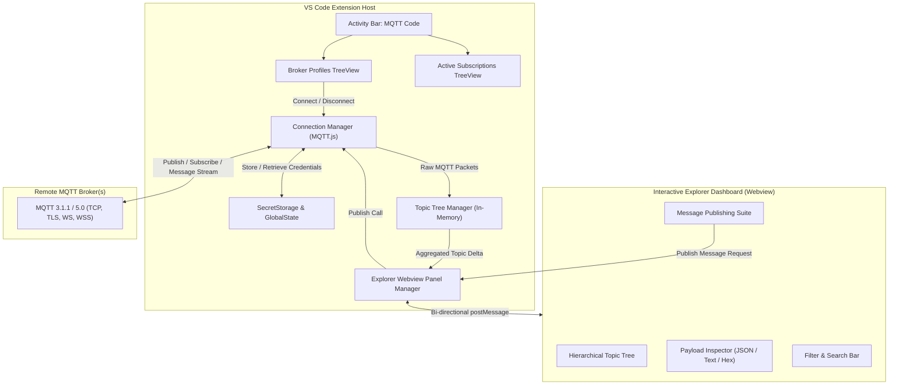

# AGENTS.md - Context & Project Architecture: MQTT Code

## Project Overview
**MQTT Code** is a Visual Studio Code extension providing an integrated MQTT explorer, topic visualiser, and message publisher. It combines native Activity Bar views for connection and subscription management with an interactive, rich Webview dashboard for real-time hierarchical topic navigation, payload inspection, and message publishing.

## High-Level Requirements & Capabilities
1. **Multi-Broker Management**:
   - Dedicated Webview dialogue window (`BrokerFormPanel`) for adding and editing broker profiles with live connection testing and certificate file picking.
   - Save and organise multiple broker configurations (Host, Port, Protocol, Client ID, Clean Session, Keepalive, QoS, TLS/SSL, MQTT v3.1.1 and v5.0).
   - Secure storage of sensitive credentials (passwords, private keys, client certificates) using VS Code `SecretStorage`.
2. **Dynamic In-Memory Topic Hierarchy**:
   - Build a real-time hierarchical tree of received topic paths (e.g. `sensors/kitchen/temperature`).
   - Track aggregate message counts, last received timestamps, retained status, and historical payloads per topic.
3. **Payload Inspector**:
   - Automatically detect and format payloads in JSON (formatted with syntax colours), raw text, Base64, and Hex.
   - Display full MQTT packet metadata: Topic, QoS, Retain flag, Packet ID, Message Size, Timestamp, and MQTT 5.0 User Properties.
4. **Publishing Suite**:
   - Quick publish command from VS Code Command Palette.
   - Full-featured publishing interface within the Webview panel with payload validation, QoS selection, retain toggle, and user properties.
5. **Topic Subscriptions & Filters**:
   - Manage multi-level (`#`) and single-level (`+`) wildcard subscriptions.
   - Live filtering of topics in the explorer by topic name or payload content.

## Architectural Model & Integration Points

## External Dependencies
- `vscode`: VS Code Extension API.
- `mqtt`: MQTT.js v5 client library supporting TCP, TLS/SSL, WebSocket, MQTT 3.1.1 and 5.0.

## Standards & Conventions
- **Language**: UK English throughout all code, identifiers, and documentation (`initialise`, `synchronise`, `visualise`, `colour`, `centre`).
- **File Naming**: `kebab-case` for all source files and assets.
- **Code Style**: Strictly typed TypeScript with modular single-purpose services.
- **Credentials**: Zero plain-text storage for passwords and certificates.
- **UI Event Handling**: Always use `mousedown` instead of `click` for interactive elements in rapidly updating views (e.g., Firehose, Topic Tree). This prevents missed clicks if the DOM re-renders between mouse press and release.
- **Documentation**: Whenever a new feature is added, modified, or removed, you MUST update `FEATURES.md` to reflect the change so it remains a definitive and granular checklist of all functionality.

## UI / UX Logic Rules
- **Topic Tree Compression**: Topic nodes in the Explorer tree that have only one child and no direct payload messages *must* be visually compressed/squashed into a single path string (e.g. `sys/devices/gateway/status`) to reduce vertical clutter.
- **Dynamic Tab Visibility**: The payload inspector panel dynamically displays tabs based on the selected node type:
  - **Leaf Node (Payload, no children)**: Shows `Payload`, `Message History`, and `User Properties`. Hides `Traffic`.
  - **Intermediate Node (No payload, has children)**: Shows `Traffic` only. Hides `Payload`, `History`, and `Properties` to avoid empty states.
  - **Hybrid Node (Payload AND children)**: Shows all 4 tabs.

## Agent Workflow Rules
- **Mandatory Verification**: After modifying any code, ALWAYS automatically run `npm run lint`, `npm run compile`, and `npm run test`. You must fix any resulting errors before completing your turn.
