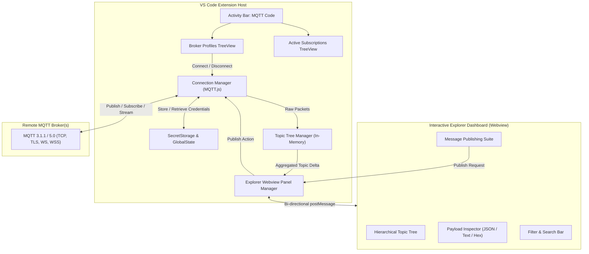

# MQTT Code - Development Guide

## Architecture & Integration Flow

The extension adopts a hybrid architecture designed to combine lightweight native sidebar views with an interactive editor panel:



## Setup & Building from Source

### Prerequisites
- Node.js (v18 or newer recommended)
- Visual Studio Code v1.90.0 or higher

### Building

1. Navigate to the extension source directory:
   ```bash
   cd mqtt-code
   ```

2. Install dependencies:
   ```bash
   npm install
   ```

3. Build the extension and webview bundle:
   ```bash
   npm run compile
   ```

4. Launch the Extension in Debug Mode:
   - Open this workspace in VS Code.
   - Press `F5` (or select **Run MQTT Code Extension** from the Run & Debug view).
   - An Extension Development Host window will launch.

## Testing

Run unit tests:
```bash
npm run test:unit
```

